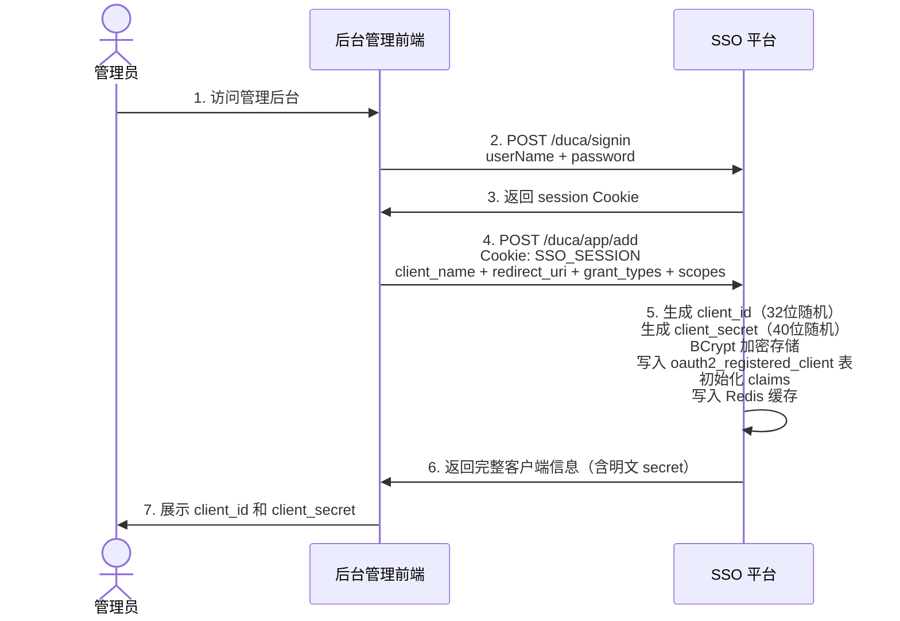
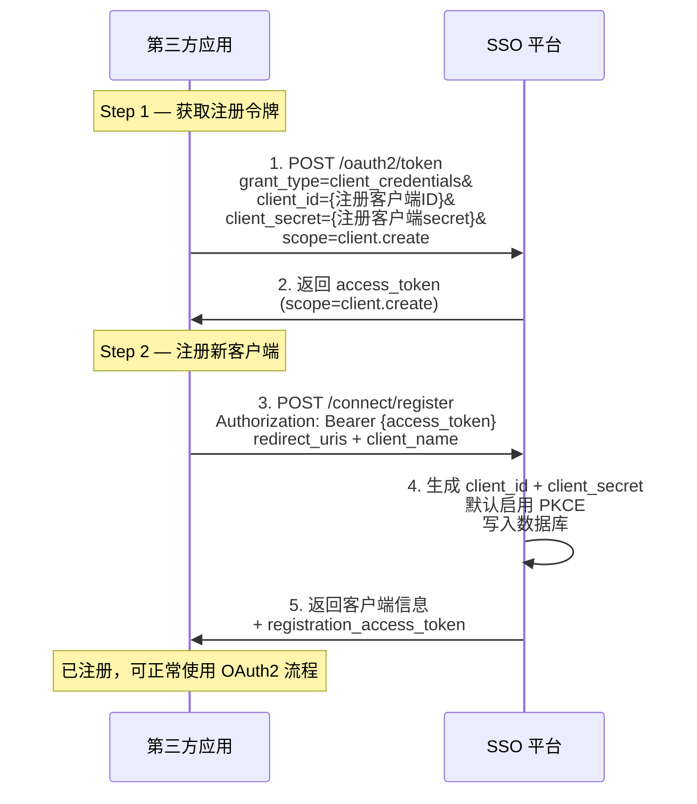
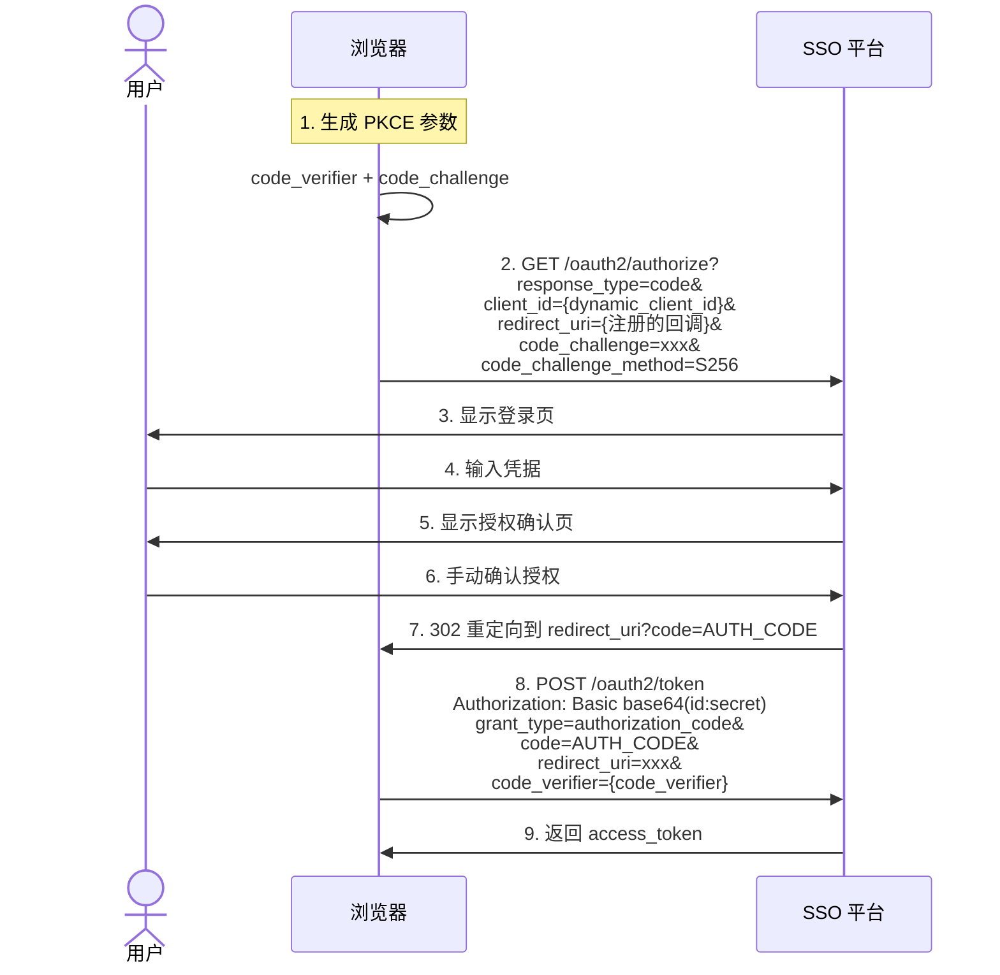

# 动态创建客户端

## 1. 概述

DMS 统一认证平台支持两种方式动态创建和管理 OAuth2 客户端：

| 方式 | 接口 | 鉴权方式 | 适用场景 |
|------|------|----------|----------|
| **管理后台 API** | `POST /duca/app/add` | 管理员 Session / Cookie | 内部管理后台创建自有客户端 |
| **OIDC 动态注册** | `POST /duca/connect/register` | Bearer access_token（scope 含 `client.create`） | 第三方应用自助注册，符合 OIDC 动态客户端注册规范 |

两种方式的核心区别：

| 对比维度 | 管理后台 API | OIDC 动态注册 |
|----------|-------------|--------------|
| 协议标准 | 自定义 | OIDC 标准规范（RFC 7591） |
| 认证方式 | 管理员 Cookie/Session | access_token（client_credentials 获取） |
| 返回 secret | 明文（在响应中返回） | 明文（仅创建时返回一次） |
| 自动 PKCE | 不强制 | **默认开启** |
| 授权确认 | 可配置 | 默认需要手动授权 |
| 自定义参数 | 支持 scope/claim 的详细配置 | 有限（client_name、redirect_uris、grant_types 等） |
| 更新/删除 | 支持（`/app/update`、`/app/del`） | 支持（通过 `registration_access_token`） |
| 中文场景 | 可自定义中文应用名 | 推荐用英文 `client_name` |

---

## 2. 名词解释

| 术语 | 说明 |
|------|------|
| **client_id** | 客户端唯一标识，自动生成（32 位随机字符串） |
| **client_secret** | 客户端密钥，自动生成（40 位随机字符串），BCrypt 加密存储 |
| **grant_type** | 授权模式，如 `authorization_code`、`client_credentials`、`refresh_token` |
| **scope** | 权限范围，如 `openid`、`profile`、`client.create` |
| **redirect_uri** | 用户授权后的回调地址 |
| **client_credentials** | 客户端凭据模式，客户端以自己的身份（非用户身份）获取令牌 |
| **registration_access_token** | OIDC 动态注册返回的令牌，用于后续查询/更新/删除该客户端 |

---

## 3. 方式一：管理后台 API

### 3.1 流程



### 3.2 创建客户端

**请求**

```http
POST /duca/app/add
Content-Type: application/json
Cookie: SSO_SESSION={管理员会话Cookie}

{
  "name": "测试客户端",
  "web_server_redirect_uri": "http://localhost:8187/app/login/callback",
  "clientAuthenticationMethod": "client_secret_post,client_secret_basic",
  "authorized_grant_types": "authorization_code,refresh_token,client_credentials",
  "scopes": [{
    "name": "openid",
    "claim": "openid"
  },{
    "name": "profile",
    "claim": "profile"
  },{
    "name": "client.create",
    "claim": "client.create"
  }]
}
```

**必填参数**

| 参数 | 类型 | 说明 |
|------|------|------|
| `name` | String | 应用名称 |
| `web_server_redirect_uri` | String | 授权回调地址（多个用逗号分隔） |
| `clientAuthenticationMethod` | String | 客户端认证方式（多个用逗号分隔） |
| `authorized_grant_types` | String | 授权模式（多个用逗号分隔） |

**可选参数**

| 参数 | 类型 | 默认值 | 说明 |
|------|------|--------|------|
| `scopes` | Array\<Scope\> | `openid` | scope 列表，每个元素含 `name` 和 `claim` |
| `requireProofKey` | Boolean | `false` | 是否强制 PKCE |
| `requireAuthorizationConsent` | Boolean | — | 是否显示授权确认页（scope 不含 openid 时才生效） |
| `accessTokenTimeToLive` | Integer | `1209600`（14天） | access_token 有效期（秒） |
| `refreshTokenTimeToLive` | Integer | `2592000`（30天） | refresh_token 有效期（秒） |
| `authCodeValidity` | Integer | `300`（5分钟） | 授权码有效期（秒） |
| `deviceCodeTimeToLive` | Integer | `300`（5分钟） | 设备授权码有效期（秒） |
| `accessTokenFormat` | String | `self-contained` | 令牌格式：`self-contained`（JWT）或 `reference`（Opaque） |
| `reuseRefreshTokens` | Boolean | `true` | 刷新时是否重新签发 refresh_token |
| `idTokenSignatureAlgorithm` | String | `RS256` | ID Token 签名算法 |
| `logoutCallback` | String | — | 退出回调地址（多个用逗号分隔） |
| `backChannelLogoutUri` | String | — | 反向通道退出地址 |
| `summary` | String | — | 应用描述 |
| `logo` | String | — | 应用 Logo 地址 |
| `startUrl` | String | — | 应用起始页 |
| `jwkSetUrl` | String | — | 自定义 JWKS 地址（用于 private_key_jwt 认证） |

**支持的 clientAuthenticationMethod**

| 值 | 说明 | 安全等级 |
|----|------|:--:|
| `client_secret_basic` | HTTP Basic Auth 方式（`Authorization: Basic base64(id:secret)`） | ★★☆ |
| `client_secret_post` | Body POST 方式（`client_id=xxx&client_secret=xxx`） | ★★☆ |
| `client_secret_jwt` | 客户端使用 secret 签名 JWT 进行认证 | ★★★ |
| `private_key_jwt` | 客户端使用私钥签名 JWT，服务端用 JWKS 公钥验签 | ★★★★ |
| `none` | 无客户端认证（仅适用于 PKCE 模式的公开客户端） | ★☆☆ |

**支持的 authorized_grant_types**

| 值 | 说明 |
|----|------|
| `authorization_code` | 授权码模式 |
| `refresh_token` | 刷新令牌 |
| `client_credentials` | 客户端凭据模式 |
| `password` | 密码模式 |
| `urn:ietf:params:oauth:grant-type:device_code` | 设备授权码模式 |
| `urn:ietf:params:oauth:grant-type:token-exchange` | 令牌交换 |
| `token-exchange` | 令牌交换（简写） |

> 未指定 `authorized_grant_types` 时，默认启用 `authorization_code`、`refresh_token`、`client_credentials`。

**返回示例**

```json
{
  "status": 0,
  "data": {
    "client_id": "H97iHqqRMCs3QO6hAXwJ5BttvckllG8h",
    "client_secret": "3QOVybSrKSRSbDXuFJ8CJYVmrsevZ239Qg6t8cin",
    "name": "测试客户端",
    "web_server_redirect_uri": "http://localhost:8187/app/login/callback",
    "authorized_grant_types": "authorization_code,refresh_token,client_credentials",
    "clientAuthenticationMethod": "client_secret_post,client_secret_basic",
    "scopes": [
      {"name": "openid", "claim": "openid"},
      {"name": "profile", "claim": "profile"},
      {"name": "client.create", "claim": "client.create"}
    ],
    "issuer": "http://localhost:8188/duca",
    "jwks": "http://localhost:8188/duca/oauth2/H97iHqqRMCs3QO6hAXwJ5BttvckllG8h/jwks",
    "token": "http://localhost:8188/duca/oauth2/token",
    "logout": "http://localhost:8188/duca/connect/logout",
    "server": "http://localhost:8188/duca/.well-known/H97iHqqRMCs3QO6hAXwJ5BttvckllG8h/openid-configurations"
  }
}
```

> **重要**：`client_secret` 仅在创建时返回明文，请立即保存。后续只能通过重置密钥接口获取新的 secret。

### 3.3 查询客户端

```http
GET /duca/app/info/appId/{client_id}
```

### 3.4 更新客户端

```http
POST /duca/app/update
Content-Type: application/json

{
  "client_id": "H97iHqqRMCs3QO6hAXwJ5BttvckllG8h",
  "name": "改名后的客户端",
  "web_server_redirect_uri": "http://newhost:8187/callback"
}
```

只需传入要修改的字段，未传的字段保持不变。

### 3.5 删除客户端

```http
GET /duca/app/del/appId/{client_id}
```

### 3.6 重置密钥

密钥泄露或定期轮换时使用，返回新的明文 secret：

```http
GET /duca/app/refresh-secret/appId/{client_id}
```

### 3.7 客户端列表

```http
POST /duca/app/list
```

管理员返回所有客户端，非管理员只返回已授权的客户端。

---

## 4. 方式二：OIDC 动态注册

符合 OIDC Dynamic Client Registration 规范（RFC 7591），让第三方应用自助注册为 OAuth2 客户端。

### 4.1 流程



### 4.2 Step 1 — 获取注册令牌

首先需要一个特殊的"注册者"客户端（预先由管理员通过方式一创建），其 scope 须包含 `client.create`：

```http
POST /duca/oauth2/token
Content-Type: application/x-www-form-urlencoded

grant_type=client_credentials
&client_id={注册者client_id}
&client_secret={注册者client_secret}
&scope=client.create
```

返回的 `access_token` 将用于后续注册请求的鉴权。

### 4.3 Step 2 — 注册新客户端

#### 最小请求

```http
POST /duca/connect/register
Content-Type: application/json
Authorization: Bearer {access_token_with_client.create_scope}

{
  "client_name": "我的应用",
  "redirect_uris": ["http://www.example.com/"]
}
```

#### 完整请求

```http
POST /duca/connect/register
Content-Type: application/json
Authorization: Bearer {access_token_with_client.create_scope}

{
  "client_name": "我的应用",
  "redirect_uris": [
    "http://www.example.com/callback"
  ],
  "token_endpoint_auth_method": [
    "client_secret_basic",
    "client_secret_post"
  ],
  "grant_types": [
    "authorization_code",
    "refresh_token",
    "client_credentials"
  ],
  "scope": "openid profile email"
}
```

| 参数 | 必填 | 类型 | 说明 |
|------|:--:|------|------|
| `client_name` | 是 | String | 应用名称（推荐英文） |
| `redirect_uris` | 是 | Array\<String\> | 授权回调地址列表 |
| `token_endpoint_auth_method` | 否 | Array\<String\> | 客户端认证方式，默认 `client_secret_basic` |
| `grant_types` | 否 | Array\<String\> | 授权模式，默认 `authorization_code` |
| `scope` | 否 | String | 请求的 scope，多个用空格分隔，默认 `openid` |

> 注意：OIDC 动态注册默认只支持 `client_secret_basic`、`client_secret_post`、`none` 三种认证方式。

#### 返回示例

```json
{
  "client_id": "b6odNDw7pPGq0KjVt8HfNj7tdmYS24QUJypXhwvB1lM",
  "client_id_issued_at": 1749900922,
  "client_name": "我的应用",
  "client_secret": "fMEwhq1BR5MdzirIaMYQwQkNK6iPOYfkFlwk8kFk75a-9BLKJo20VjnMhAmCp4mb",
  "redirect_uris": [
    "http://www.example.com/"
  ],
  "grant_types": [
    "authorization_code"
  ],
  "response_types": [
    "code"
  ],
  "token_endpoint_auth_method": "client_secret_basic",
  "id_token_signed_response_alg": "RS256",
  "registration_client_uri": "http://sso.example.com/duca/connect/register?client_id=b6odNDw7pPGq0KjVt8HfNj7tdmYS24QUJypXhwvB1lM",
  "registration_access_token": "eyJraWQiOiIx...",
  "client_secret_expires_at": 0
}
```

| 返回字段 | 说明 |
|----------|------|
| `client_id` | 新客户端的唯一标识（自动生成） |
| `client_secret` | 密钥明文，**仅创建时返回一次** |
| `registration_client_uri` | 用于后续查询/更新/删除的 REST 端点 |
| `registration_access_token` | 管理令牌，用于后续操作该客户端的配置 |
| `client_secret_expires_at` | 密钥过期时间戳，`0` 表示永不过期 |

### 4.4 动态注册的默认行为

OIDC 动态注册创建的客户端具有以下默认设置：

| 设置项 | 默认值 | 说明 |
|--------|--------|------|
| PKCE | **强制开启** | token 换取时必须有 `code_verifier` |
| 授权确认 | **强制开启** | 用户每次都需要手动确认授权 |
| 令牌格式 | `self-contained` (JWT) | — |
| ID Token 签名 | `RS256` | — |
| access_token 有效期 | 14 天 | — |
| refresh_token 有效期 | 30 天 | — |

### 4.5 验证动态注册的客户端

动态注册的客户端默认**强制 PKCE 且需要手动授权**，验证流程如下：



**http 请求示例**

```bash
# 1. 获取授权码（浏览器访问）
GET /duca/oauth2/authorize?response_type=code&
  client_id={dynamic_client_id}&
  redirect_uri=http://www.example.com/&
  code_challenge={code_challenge}&
  code_challenge_method=S256

# 2. 用授权码换取令牌
POST /duca/oauth2/token
Authorization: Basic {base64(client_id:client_secret)}
Content-Type: application/x-www-form-urlencoded

grant_type=authorization_code
&redirect_uri=http://www.example.com/
&code={auth_code}
&code_verifier={code_verifier}
```

### 4.6 自定义客户端元数据

平台支持扩展元数据字段，可以在注册请求中附带：

```http
POST /duca/connect/register
Content-Type: application/json
Authorization: Bearer {{token}}

{
  "client_name": "高级客户端",
  "redirect_uris": ["http://www.example.com/"],
  "logo_uri": "https://www.example.com/logo.png",
  "contacts": ["admin@example.com"]
}
```

扩展元数据字段会存储在 `oauth2_registered_client` 表的 `client_settings` 中。

---

## 5. 两种方式的场景对比

| 场景 | 推荐方式 | 原因 |
|------|----------|------|
| 内部管理系统添加自己的子应用 | **管理后台 API** | 灵活配置 scope/claim、支持中文名、完整的令牌参数控制 |
| 开放平台，第三方自助接入 | **OIDC 动态注册** | 标准协议，无需人工审核，自动生成凭据 |
| SaaS 租户自动开通 | **OIDC 动态注册** | 可通过 `client_credentials` 自动化，无需管理后台 Cookie |
| CI/CD 自动创建测试客户端 | **管理后台 API** | 脚本携带 Cookie 即可完成，配置可控 |

---

## 6. 注意事项

1. **client_secret 仅返回一次**：创建响应中的 `client_secret` 是明文，丢失后只能通过重置密钥获取新的
2. **OIDC 动态注册需要 `client.create` scope**：注册者客户端必须预先配置此 scope，否则返回 `403`
3. **密钥 BCrypt 加密存储**：数据库中的 `client_secret` 为 BCrypt 密文，不可逆
4. **动态注册默认强制 PKCE**：通过 `/connect/register` 创建的客户端，在换取令牌时必须有 `code_verifier`
5. **动态注册默认需要手动授权**：每次授权都需要用户确认（即使 scope 包含 `openid`）
6. **redirect_uri 必须预先注册**：授权请求中的 `redirect_uri` 必须与客户端注册时的一致
7. **`registration_access_token` 的 scope 为 `client.read`**：仅用于管理该客户端配置，不能用于其他资源的访问
