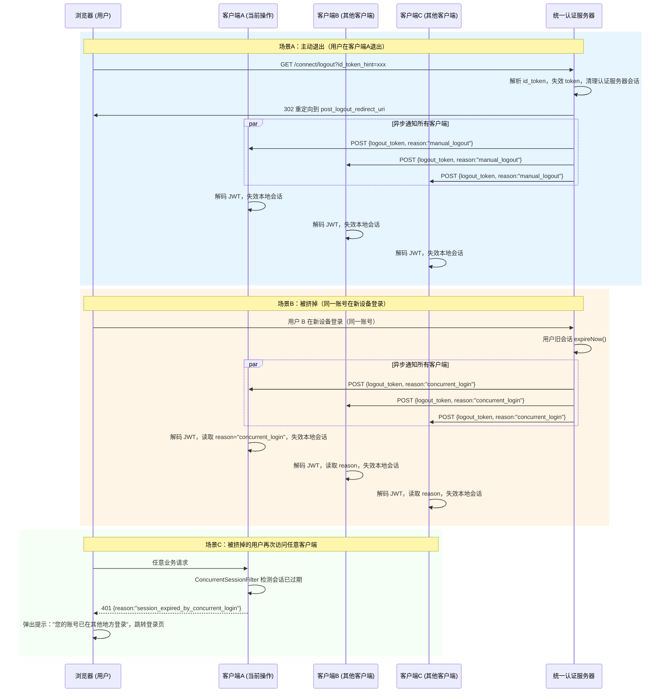
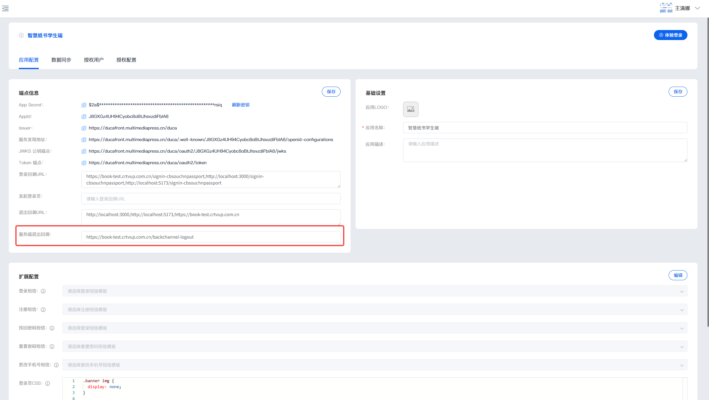

# 统一认证退出对接说明

## 概述

接入统一认证后，当用户在任意一个客户端执行退出，或同一账号在其他地方登录导致被挤掉，认证服务器会通过 **Back-Channel Logout**（服务端到服务端）通知你的客户端同步退出。

---

## 两个关键回调地址

在统一认证管理后台注册客户端时，需要配置两个与退出相关的回调地址：

### post_logout_redirect_uri（前端退出重定向地址）

用户主动退出后，认证服务器将浏览器重定向到此地址。这是 **OIDC RP-Initiated Logout** 标准流程中的前端跳转地址。

- **触发场景**：用户在认证服务器页面点击退出或客户端发起 `/connect/logout` 请求
- **数据流向**：认证服务器 → 浏览器（前端重定向）
- **作用**：退出完成后告诉浏览器跳转到哪里（通常是客户端的登录页或首页）
- **示例**：`http://your-app.com/login?logout=success`

### backChannelLogoutUri（后端退出通知地址）

认证服务器通过 **服务端到服务端** 的 HTTP POST 请求，通知客户端使某个用户的本地会话失效。

- **触发场景**：
  - 用户在任意客户端主动退出，认证服务器通知其他客户端同步退出
  - 同一账号在新设备登录，挤掉旧会话后通知所有客户端
- **数据流向**：认证服务器 → 客户端后端（服务端直连，不经过浏览器）
- **携带数据**：POST 表单参数 `logout_token`（JWT），包含用户名、会话ID、退出原因等
- **示例**：`http://your-app.com/duca/backChannelLogout`

### 二者区别

| 地址 | 方向 | 协议 | 携带数据 | 用途 |
|------|------|------|----------|------|
| `post_logout_redirect_uri` | 认证服务器 → 浏览器 → 客户端 | 前端重定向 | 无（仅跳转） | 退出后页面跳转 |
| `backChannelLogoutUri` | 认证服务器 → 客户端后端 | 后端 POST | `logout_token`（JWT） | 通知客户端失效本地会话 |

> 简单理解：`post_logout_redirect_uri` 管"退出后页面去哪"，`backChannelLogoutUri` 管"退出后数据怎么同步"。

---

## 1. 退出流程图



---

## 2. 配置退出回调地址

在统一认证管理后台注册客户端时，填写 **退出回调地址**（`backChannelLogoutUri`），格式为你的客户端接收退出通知的完整 URL（由客户端自定义）。

也可以配置多个，逗号分隔：

```
http://your-app.com/duca/backChannelLogout
或
http://app1.com/duca/backChannelLogout,http://app2.com/duca/backChannelLogout
```

> 注意：此地址需要不需要进行认证：

统一认证服务端配置：退出回调地址

---

## 3. 回调接口规范

认证服务器通过 HTTP POST 调用退出回调地址，Content-Type 为 `application/x-www-form-urlencoded`。

### 请求方式

```
POST /backChannelLogout
Content-Type: application/x-www-form-urlencoded
```

### 请求参数

| 参数名 | 类型 | 必填 | 说明 |
|--------|------|------|------|
| `logout_token` | String | 是 | JWT 格式的注销令牌 |

### logout_token 结构

解码后 payload 示例：

```json
{
  "iss": "http://sso.17-do.com/duca",
  "sub": "test",
  "aud": ["DrBIoSS6Onqz8Ulbd0Owa1bpXAM0uG6s"],
  "iat": 1684400000,
  "exp": 1684400300,
  "jti": "uuid-xxx",
  "sid": "session-id-abc123",
  "uuid": "user-uuid-def456",
  "reason": "manual_logout",
  "events": {
    "http://schemas.openid.net/event/backchannel-logout": {}
  }
}
```

| 字段 | 说明 |
|------|------|
| `iss` | 签发者，即统一认证服务器地址 |
| `sub` | 要退出的用户名 |
| `aud` | 目标客户端 ID（你的 clientId） |
| `exp` | 过期时间（5 分钟有效） |
| `sid` | 认证服务器的会话 ID |
| `reason` | **退出原因**：`manual_logout`（主动退出）或 `concurrent_login`（被挤掉） |
| `events` | OIDC Back-Channel Logout 标准事件 |

### 返回值

| 状态码 | 说明 |
|--------|------|
| `200` | 处理成功 |
| 其他 | 处理失败（认证服务器会忽略返回，仅记录日志） |

---

## 4. 客户端处理方式

客户端前端提示"账号已在其他地方登录"

要让被挤掉的用户看到"您的账号已在其他地方登录"的提示，需要**后端**和**前端**配合实现。

> 客户端流程

```
认证服务器检测到会话被挤掉
        ↓
POST logout_token → 客户端 /backChannelLogout
        ↓
客户端后端: 解析 JWT → 找到本地 session → expireNow()
        ↓
用户浏览器下次发请求 → 客户端后端返回 401 {reason: "session_expired"}
        ↓
前端拦截 401 → 弹出提示 → 跳转登录页
```

### 4.1 服务端实现 

```java
@RestController
public class LogoutCallbackController {
    /**
     * 以下逻辑仅供参考
     */
    @Resource
    private SessionRegistry sessionRegistry;  // Spring Session 会话注册表
    @Resource
    private RedisTemplate<String, Object> redisTemplate;

    @PostMapping("/backChannelLogout")
    public void handleBackChannelLogout(HttpServletRequest request) {
        String logoutToken = request.getParameter("logout_token");
        if (logoutToken == null) return;

        // 1. 解码验证 JWT
        Jwt jwt = jwtDecoder.decode(logoutToken);

        String subject = jwt.getSubject();          // 要退出的用户名
        String reason = jwt.getClaimAsString("reason");  // manual_logout / concurrent_login

        // 2. 找到该用户的所有本地会话并失效
        List<SessionInformation> sessions = sessionRegistry.getAllSessions(subject, false);
        for (SessionInformation sessionInfo : sessions) {
            sessionInfo.expireNow();
        }

        // 3. 存储退出原因（供前端查询）
        if (sessions != null && !sessions.isEmpty()) {
            String reason = jwt.getClaimAsString("reason");
            for (SessionInformation si : sessions) {
                redisTemplate.opsForValue().set(
                    "logout_reason:" + si.getSessionId(),
                    reason != null ? reason : "manual_logout",
                    300, TimeUnit.SECONDS);
            }
        }
    }
}
```

 
### 4.2 前端检测会话并提示

`/api/session/check` 由客户端自身实现，用于前端轮询检测**客户端本地会话**是否已因 backchannel logout 被失效。

```java
@GetMapping("/api/session/check")
public Map<String, Object> checkSession(HttpServletRequest request) {
    HttpSession session = request.getSession(false);
    if (session == null) {
        return Map.of("code", 401, "reason", "session_expired_by_concurrent_login");
    }

    String reason = (String) redisTemplate.opsForValue()
        .get("logout_reason:" + session.getId());

    if (reason != null) {
        Map<String, Object> result = new HashMap<>();
        result.put("code", 401);
        result.put("reason", "session_expired_by_concurrent_login");
        result.put("logout_type", reason);
        result.put("msg", "concurrent_login".equals(reason)
            ? "您的账号已在其他地方登录"
            : "您已退出登录");
        return result;
    }

    return Map.of("code", 200, "data", Map.of("status", "active"));
}
```

前端引入 `session-monitor.js`（仅共参考）：
```html
<script src="http://xx/static/js/session-monitor.js"></script>
<script>
SessionMonitor.init({
    checkUrl: '/duca/api/session/check',
    checkInterval: 30000,
    onSessionExpired: function(response) {
        // response.msg 包含后端返回的提示语
        // 清理本地存储、跳转登录页等
        window.location.href = '/login?expired=concurrent';
    }
});
</script>
```

```javascript
/**
 * 会话监控 - 检测账号在其他地方登录导致当前会话失效
 * 
 * 使用方式:
 * 1. 在页面中引入此JS文件
 * 2. 初始化: SessionMonitor.init({ onSessionExpired: function() { ... } });
 * 
 * @author wanghailong
 * @date 2026/01/15
 */
(function(window) {
    'use strict';
    
    var SessionMonitor = {
        config: {
            // 检测间隔(毫秒)
            checkInterval: 30000, // 30秒检测一次
            // 检测URL
            checkUrl: '/api/session/check',
            // 会话过期回调
            onSessionExpired: null,
            // 是否启用
            enabled: true
        },
        
        timer: null,
        isExpired: false,
        
        /**
         * 初始化会话监控
         */
        init: function(options) {
            if (options) {
                this.config = Object.assign(this.config, options);
            }
            
            if (this.config.enabled) {
                this.startMonitoring();
                this.setupAjaxInterceptor();
            }
        },
        
        /**
         * 开始监控
         */
        startMonitoring: function() {
            var self = this;
            
            // 清除旧定时器
            if (this.timer) {
                clearInterval(this.timer);
            }
            
            // 定期检测会话状态
            this.timer = setInterval(function() {
                self.checkSession();
            }, this.config.checkInterval);
            
            console.log('[SessionMonitor] 会话监控已启动');
        },
        
        /**
         * 停止监控
         */
        stopMonitoring: function() {
            if (this.timer) {
                clearInterval(this.timer);
                this.timer = null;
                console.log('[SessionMonitor] 会话监控已停止');
            }
        },
        
        /**
         * 检测会话状态
         */
        checkSession: function() {
            if (this.isExpired) {
                return; // 已经过期就不再检测
            }
            
            var self = this;
            var xhr = new XMLHttpRequest();
            
            xhr.open('GET', this.config.checkUrl, true);
            xhr.setRequestHeader('X-Requested-With', 'XMLHttpRequest');
            
            xhr.onload = function() {
                if (xhr.status === 401) {
                    try {
                        var response = JSON.parse(xhr.responseText);
                        if (response.reason === 'session_expired_by_concurrent_login') {
                            self.handleSessionExpired(response);
                        }
                    } catch (e) {
                        console.error('[SessionMonitor] 解析响应失败:', e);
                    }
                }
            };
            
            xhr.onerror = function() {
                console.error('[SessionMonitor] 会话检测请求失败');
            };
            
            xhr.send();
        },
        
        /**
         * 设置AJAX拦截器
         */
        setupAjaxInterceptor: function() {
            var self = this;
            
            // 拦截XMLHttpRequest
            var originalOpen = XMLHttpRequest.prototype.open;
            var originalSend = XMLHttpRequest.prototype.send;
            
            XMLHttpRequest.prototype.open = function() {
                this._url = arguments[1];
                return originalOpen.apply(this, arguments);
            };
            
            XMLHttpRequest.prototype.send = function() {
                var xhr = this;
                var originalOnReadyStateChange = xhr.onreadystatechange;
                
                xhr.onreadystatechange = function() {
                    if (xhr.readyState === 4) {
                        // 检测401响应
                        if (xhr.status === 401) {
                            try {
                                var response = JSON.parse(xhr.responseText);
                                if (response.reason === 'session_expired_by_concurrent_login') {
                                    self.handleSessionExpired(response);
                                }
                            } catch (e) {
                                // 忽略解析错误
                            }
                        }
                    }
                    
                    if (originalOnReadyStateChange) {
                        return originalOnReadyStateChange.apply(this, arguments);
                    }
                };
                
                return originalSend.apply(this, arguments);
            };
            
            // 如果使用了fetch API
            if (window.fetch) {
                var originalFetch = window.fetch;
                window.fetch = function() {
                    return originalFetch.apply(this, arguments).then(function(response) {
                        if (response.status === 401) {
                            response.clone().json().then(function(data) {
                                if (data.reason === 'session_expired_by_concurrent_login') {
                                    self.handleSessionExpired(data);
                                }
                            }).catch(function() {
                                // 忽略解析错误
                            });
                        }
                        return response;
                    });
                };
            }
            
            console.log('[SessionMonitor] AJAX拦截器已设置');
        },
        
        /**
         * 处理会话过期
         */
        handleSessionExpired: function(response) {
            if (this.isExpired) {
                return; // 避免重复处理
            }
            
            this.isExpired = true;
            this.stopMonitoring();
            
            console.warn('[SessionMonitor] 检测到账号在其他地方登录,当前会话已失效');
            console.warn('[SessionMonitor] 用户:', response.username);
            
            // 显示提示
            this.showExpiredNotification(response);
            
            // 执行回调
            if (typeof this.config.onSessionExpired === 'function') {
                this.config.onSessionExpired(response);
            } else {
                // 默认行为:3秒后跳转登录页
                setTimeout(function() {
                    window.location.href = '/login?expired=concurrent';
                }, 3000);
            }
        },
        
        /**
         * 显示会话过期通知
         */
        showExpiredNotification: function(response) {
            // 创建通知元素
            var notification = document.createElement('div');
            notification.style.cssText = 
                'position: fixed; top: 20px; left: 50%; transform: translateX(-50%); ' +
                'background: #ff6b6b; color: white; padding: 15px 30px; ' +
                'border-radius: 5px; box-shadow: 0 4px 12px rgba(0,0,0,0.15); ' +
                'z-index: 99999; font-size: 16px; font-weight: bold; ' +
                'animation: slideDown 0.3s ease-out;';
            
            notification.innerHTML = 
                '<div style="text-align: center;">' +
                '<div style="margin-bottom: 5px;">⚠️ 会话已失效</div>' +
                '<div style="font-size: 14px; font-weight: normal;">' +
                '您的账号已在其他地方登录,3秒后将跳转到登录页' +
                '</div>' +
                '</div>';
            
            // 添加动画
            var style = document.createElement('style');
            style.textContent = 
                '@keyframes slideDown {' +
                '  from { transform: translateX(-50%) translateY(-100%); opacity: 0; }' +
                '  to { transform: translateX(-50%) translateY(0); opacity: 1; }' +
                '}';
            document.head.appendChild(style);
            
            document.body.appendChild(notification);
        }
    };
    
    // 暴露到全局
    window.SessionMonitor = SessionMonitor;
    
})(window);

```


---

## 5. 退出原因对照

| reason 值 | 含义 | 前端建议提示语 |
|-----------|------|--------------|
| `manual_logout` | 用户主动退出 | "您已退出登录" |
| `concurrent_login` | 被其他地方登录挤掉 | "您的账号已在其他地方登录" |

---

